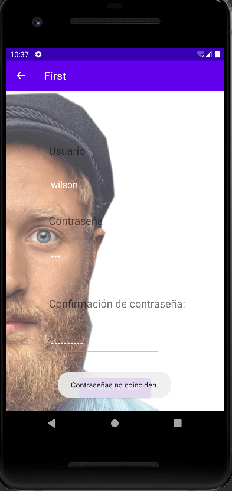

#PrimerApp

El único usuario que existe es el admin.

De una pagina de "gatos que no existen", he sacado las imagenes de los gatos y al recargar la página, saca otro gato.
Una forma de enviar datos de una activity a otra.

Cuando la contraseña del usuario no coincide en con la confirmación, manda un error.

